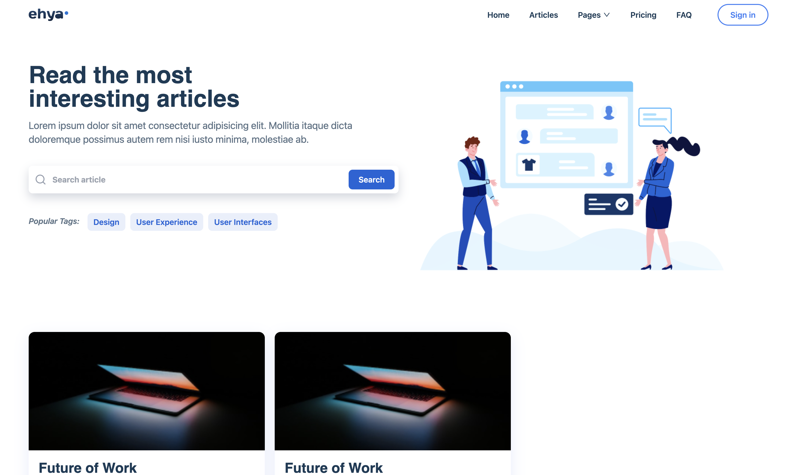
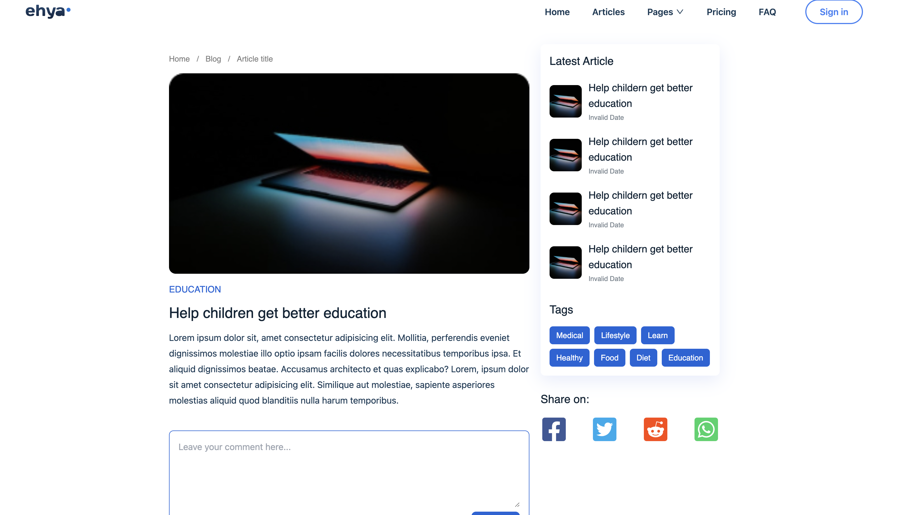
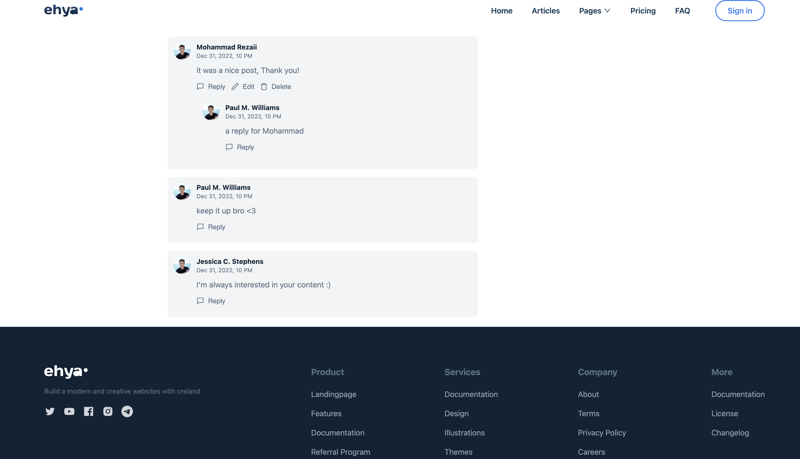

# Ehya Blogging Website

Ehya is a blogging website built using the MERN stack (MongoDB, Express.js, React.js, Node.js) and Tailwind CSS. It allows users to create an account, write and publish blogs, view and comment on other users' blogs, and manage their personal profile.

## Features

- User authentication:
  - Sign up: Users can create a new account by providing their name, email address, and password.
  - Login: Existing users can log in using their email address and password.
  - Forgot password: Users can request a password reset email if they forget their password.
  - Update password: Users can reset their password using the password reset link sent to their email.
  
- Blog management:
  - Create and publish blogs: Users can write and publish their own blogs, including a title, content, and optional images.
  - View blogs: Users can browse and read blogs posted by other users.
  - Comment on blogs: Users can leave comments on blogs posted by other users.
  
- User profile:
  - Personal profile: Each user has a personal profile page displaying their name, profile picture, and a list of their published blogs.
  - Profile update: Users can update their profile information, including their name and profile picture.

## Technologies Used

- MongoDB: A NoSQL database used for storing user accounts, blogs, and comments.
- Express.js: A web application framework for creating the server-side API endpoints.
- React.js: A JavaScript library for building the user interface of the blogging website.
- Node.js: A JavaScript runtime environment used for server-side scripting.
- Tailwind CSS: A utility-first CSS framework for styling the components and layout of the website.
- Other dependencies: bcrypt for password hashing, JSON Web Tokens (JWT) for user authentication, nodemailer for sending emails, etc.

